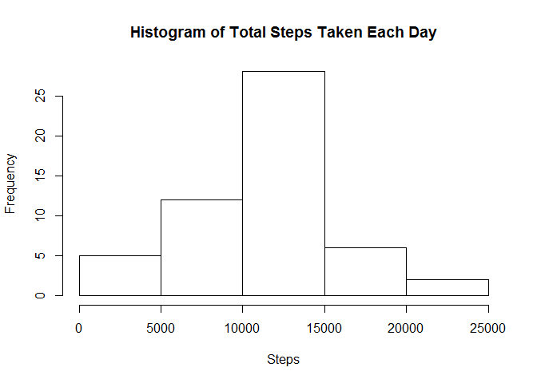
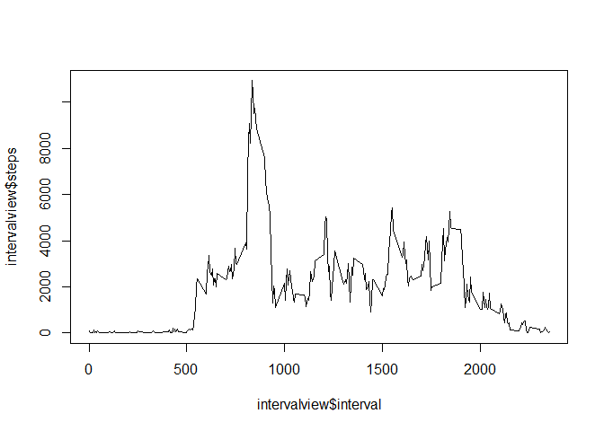
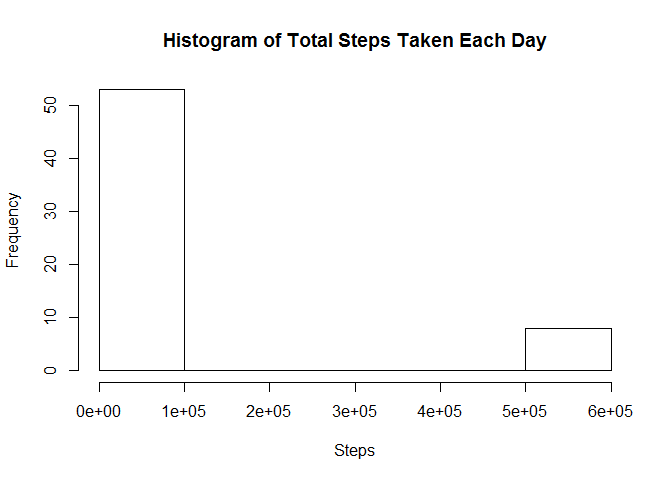
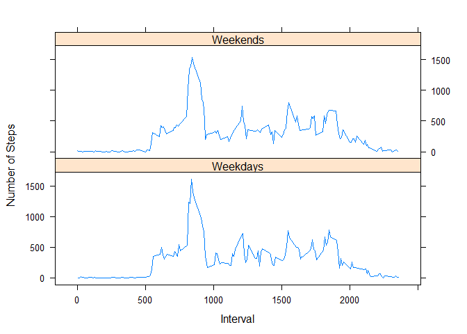

# Reproducible Research: Peer Assessment 1


## Loading and preprocessing the data

```r
setwd("C:\\Users\\SZXP0196\\Desktop\\Rdata")
activity<-read.csv("activity.csv",header=TRUE,sep=",")
```

``

## What is mean total number of steps taken per day?

```r
# make a histogram of the total number of steps taken each day
daysum<-aggregate(.~date,data=activity,sum,na.rm=TRUE)
hist(daysum$steps,main = "Histogram of Total Steps Taken Each Day", xlab = "Steps")
```



```r
#calculate the mean and median total number of steps taken per day
stepmean<-mean(daysum$steps)
stepmedian<-median(daysum$steps)
```


## What is the average daily activity pattern?

```r
#Make a time series plot (i.e. type = "l") of the 5-minute interval (x-axis) and the average number of steps taken, averaged across all days (y-axis)
intervalview<-aggregate(steps~interval,data=activity,sum)
plot(intervalview$interval,intervalview$steps,type="l",main="")
```



```r
#2.	Which 5-minute interval, on average across all the days in the dataset, contains the maximum number of steps?
maxInt <- intervalview$interval[which.max(intervalview$steps)]
```


## Imputing missing values

```r
#Calculate and report the total number of missing values in the dataset (i.e. the total number of rows with NAs)
rowNAs <- is.na(rowSums(activity[ ,c(1,3)]))
numNAs <- sum(rowNAs)
#fill in all of the missing values in the dataset with mean of the day.
revact <- merge(x=activity,y=intervalview, by="interval",suffixes = c("", ".Avg"))
revact <- revact[with(revact, order(date)), ]
revact$steps[rowNAs] <- revact$steps.Avg[rowNAs]
revact <- revact[,c(2,3,1)]
#Create a new dataset that is equal to the original dataset but with the missing data fille
daysum2<- aggregate(.~revact$date, data =revact, sum)
#make a histogram of the day
hist(daysum2$steps, main = "Histogram of Total Steps Taken Each Day", xlab = "Steps")
```



```r
#calculate the mean and median totoal number of steps taken per day
stepmean2 = mean(daysum2$steps)
stepmedian2 = median(daysum2$steps)
```


## Are there differences in activity patterns between weekdays and weekends?

```r
#Create a new factor variable in the dataset with two levels -- "weekday" and "weekend" indicating whether a given date is a weekday or weekend day.
revact$date <- as.Date(revact$date)
revact <- cbind(revact, (weekdays(revact$date) == "Sunday" | weekdays(revact$date) == "Saturday"))
colnames(revact) <- c("steps", "date","interval", "Wday")
library(plyr)
revact2<- ddply(revact, c("interval", "Wday"), summarize, outVal = mean(steps))
revact2$Wday <- as.factor(revact2$Wday)
levels(revact2$Wday <- c("Weekends", "Weekdays"))
```

```
## NULL
```

```r
#Make a panel plot containing a time series plot (i.e. type = "l") of the 5-minute interval (x-axis) and the average number of steps taken, averaged across all weekday days or weekend days (y-axis). 
library(lattice)
xyplot(outVal ~ interval | Wday, data = revact2, type = "l", layout = c(1,2), ylab = "Number of Steps", xlab = "Interval")
```



